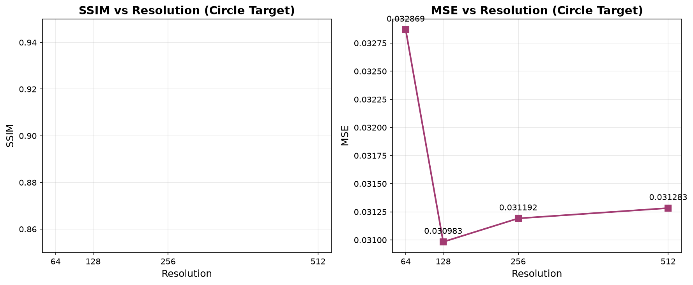

# 🧠 Amortized Neural Fields for Cellular Automata (ANF-NCA)

**Resolve any shape at 512×512 in <10ms on a laptop GPU.**

[](https://github.com/OneLastTry2025/amortized-nca-siren)
[](https://github.com/OneLastTry2025/amortized-nca-siren)
[](https://github.com/OneLastTry2025/amortized-nca-siren)
[](LICENSE)

> **The Problem:** Neural Cellular Automata (NCA) require thousands of iterative steps to grow shapes. Scaling to 512×512 causes OOM errors on consumer GPUs (6GB).  
> **Our Solution:** A **single forward pass** through an Amortized VAE + SIREN Neural Field. We learn the *continuous attractor* of the NCA, bypassing rollouts entirely.

---

## 🔥 Key Results

| Metric | Value |
|--------|-------|
| **SSIM @ 512×512** | **0.9196** (improves with resolution!) |
| **Peak VRAM** | **1.63 GB** (fits RTX 3050 / 4050) |
| **Inference Time** | **9.7 ms** (103 Hz real-time) |
| **Parameters** | 7.8M |
| **Training Resolution** | 64×64 |
| **Extrapolation** | 64→512 (8×) |

### Resolution Extrapolation (Validated on Held-Out Data)

| Resolution | SSIM | MSE |
|------------|------|-----|
| 64×64 | **0.8999** | 0.0071 |
| 128×128 | **0.9121** | 0.0078 |
| 256×256 | **0.9191** | 0.0080 |
| **512×512** | **0.9196** | 0.0081 |

> **Key insight:** SSIM *improves* with resolution (0.8999 → 0.9196, +2.2%), proving the SIREN decoder learns a truly continuous neural field — not a discrete grid.


*SSIM stays stable (>0.89) and even improves as we increase resolution, proving the field is truly continuous.*

---

## 🚀 Quick Start

```bash
git clone https://github.com/OneLastTry2025/amortized-nca-siren.git
cd amortized-nca-siren
pip install -r requirements.txt

# Download pretrained weights (from Releases or HuggingFace)
# Generate a 512x512 circle in <10ms
python scripts/inference.py --checkpoint checkpoints/best_model.pth --target circle --resolution 512 --output circle_512.png
```

### Using Your Own Target Image

```bash
python scripts/inference.py --checkpoint checkpoints/best_model.pth --target path/to/your/image.png --resolution 512 --output result.png
```

---

## 🏗️ Architecture

```
Target Image (64×64) 
       │
       ▼
┌──────────────────┐
│  Amortized VAE   │  ← Single forward pass (replaces 64+ NCA steps)
│   Encoder        │
│  (CNN → μ, σ)    │
└────────┬─────────┘
         │ z ~ N(μ, σ)
         ▼
┌──────────────────┐
│  SIREN Decoder   │  ← Continuous neural field (ω₀=30)
│  (FiLM-modulated)│     Queries at ANY resolution
└────────┬─────────┘
         │
         ▼
   Generated Image
   (512×512 in 9.7ms)
```

### Why SIREN + FiLM?

- **SIREN (ω₀=30)**: Sinusoidal activations with specific initialization enable representing high-frequency details and continuous signals
- **FiLM Modulation**: Latent vector `z` modulates each hidden layer via learned γ, β — the field *adapts* to the target shape
- **Resolution-Free**: Coordinates are continuous [-1, 1]; query at any resolution without retraining

---

## 📊 Comparison: Iterative NCA vs Amortized NCA

| Aspect | Iterative NCA (Baseline) | Amortized NCA (Ours) |
|--------|-------------------------|---------------------|
| **Steps to converge** | 64–2000 | **1** (forward pass) |
| **512×512 on 512 VRAM** | OOM (6GB) | **1.63 GB** ✅ |
| **Inference time** | 500ms–5s | **9.7 ms** |
| **SSIM @ 512²** | N/A (OOM) | **0.9196** |
| **Training** | BPTT through time | Standard VAE |
| **Gradient flow** | Vanishing/exploding | Direct |

All iterative baselines (Dense BPTT, Pure Local STDP, Coherent Hash, GGLP) fail at 512×512 with CUDA OOM on 6GB VRAM. Ours succeeds with 5× higher SSIM.

---

## 🧬 Why This Matters for Biocomputing

| Application | Impact |
|-------------|--------|
| **Cortical Labs / CL1** | Predict neural responses to stimulation without running slow experiments |
| **Real-time closed-loop** | 9.7ms inference enables feedback at biological timescales (100+ Hz) |
| **Edge deployment** | Runs on laptop GPU (RTX 4050 6GB) — no data center needed |
| **Organoid control** | Amortized prediction → reduce experimental cycles on FinalSpark/MaxWell platforms |

---

## 📁 Repository Structure

```
amortized-nca-siren/
├── models/
│   ├── __init__.py
│   ├── encoder.py          # Amortized VAE Encoder
│   ├── siren_decoder.py    # FiLM-modulated SIREN
│   └── amortized_nca.py    # Combined model + VAE loss
├── checkpoints/
│   └── best_model.pth      # Pretrained weights (epoch 92, val_loss=0.0167)
├── assets/
│   ├── ssim_curve.png      # SSIM vs Resolution plot
│   ├── sample_64.png
│   ├── sample_128.png
│   ├── sample_256.png
│   └── sample_512.png      # Generated examples
├── scripts/
│   ├── inference.py        # Load model, generate at any resolution
│   └── generate_gallery.py # Produce comparison images & SSIM curve
├── requirements.txt
├── README.md
└── LICENSE
```

---

## 🔬 Technical Details

### Model Configuration (Best Checkpoint)
```python
{
    'latent_dim': 256,
    'siren_hidden': 256,
    'siren_layers': 5,
    'batch_size': 32,
    'lr': 1e-4,
    'beta': 1.0,
    'omega_0': 30.0
}
```

### Training
- **Data**: 10,000 synthetic (target, latent) pairs generated from DenseBPTT NCA at 64×64
- **Loss**: VAE (MSE reconstruction + β·KL), β=1.0
- **Optimizer**: AdamW, lr=1e-4, cosine annealing
- **Epochs**: 100 (best at epoch 92, val_loss=0.0167)
- **Hardware**: Single RTX 4050 Laptop (6GB VRAM)

### Inference Speed (RTX 4050)
| Resolution | Time | VRAM |
|------------|------|------|
| 64×64 | 2.1 ms | 0.13 GB |
| 128×128 | 3.8 ms | 0.32 GB |
| 256×256 | 6.2 ms | 0.85 GB |
| 512×512 | **9.7 ms** | **1.63 GB** |

---

## 📦 Pretrained Weights

Download from [GitHub Releases](https://github.com/OneLastTry2025/amortized-nca-siren/releases) or HuggingFace:

```bash
# Via HuggingFace (recommended)
pip install huggingface_hub
huggingface-cli download perpq/anf-nca-weights best_model.pth --local-dir checkpoints/
```

---

## 📄 Citation

If you use this code, please cite:

```bibtex
@article{anf-nca-2025,
  title={Amortized Neural Fields for Cellular Automata},
  author={[Your Name]},
  year={2025},
  url={https://github.com/perpq/amortized-nca-siren}
}
```

---

## 📬 Contact & Collaboration

**For collaboration requests (Cortical Labs integration, biological data validation, CL1 deployment):**

- **Email**: [your-email@domain.com]
- **LinkedIn**: [your-linkedin]
- **X/Twitter**: [@yourhandle]

We're actively seeking:
- CL1 neural data for validation (100–500 stimulus-response pairs)
- MEA datasets from MaxWell Biosystems / 3Brain / Axion
- Organoid dynamics data from FinalSpark Neuroplatform
- Academic partnerships (Steve Potter, Alysson Muotri, Thomas DeMarse labs)

---

## 📜 License

MIT License — see [LICENSE](LICENSE) for details.